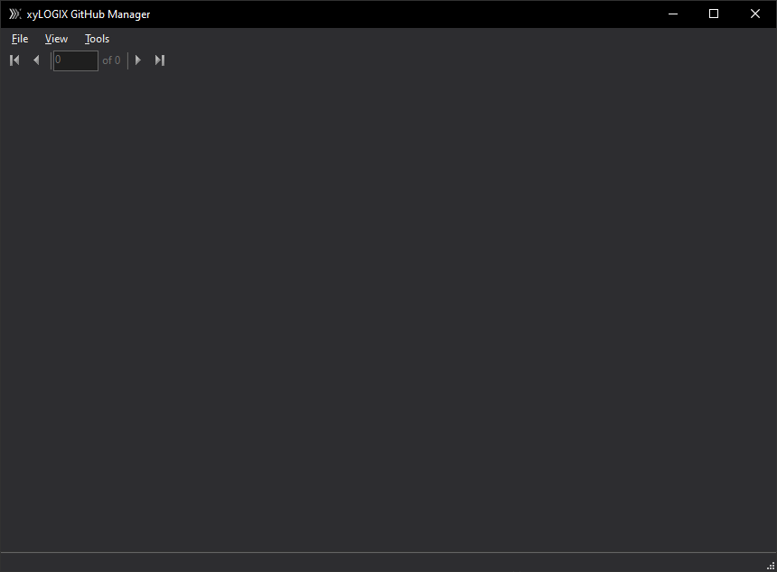
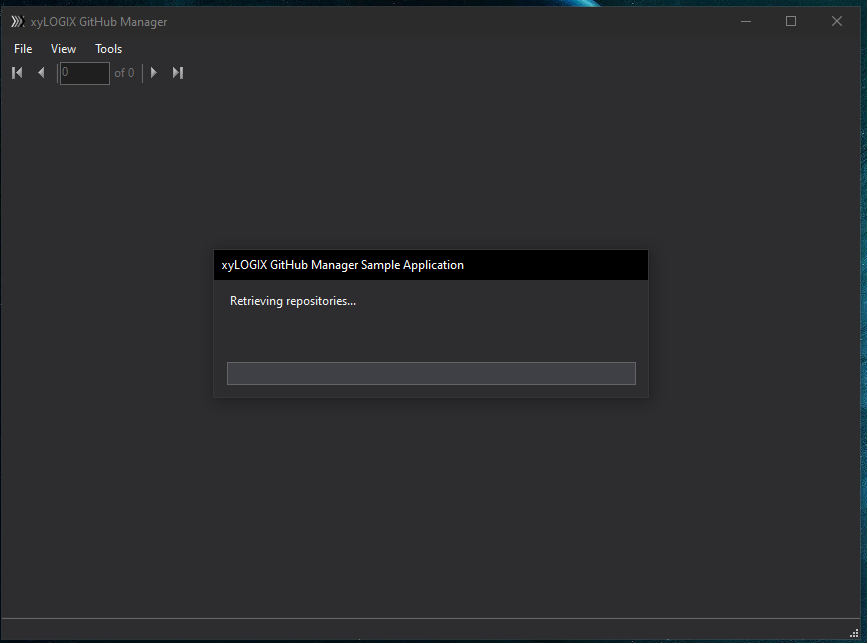
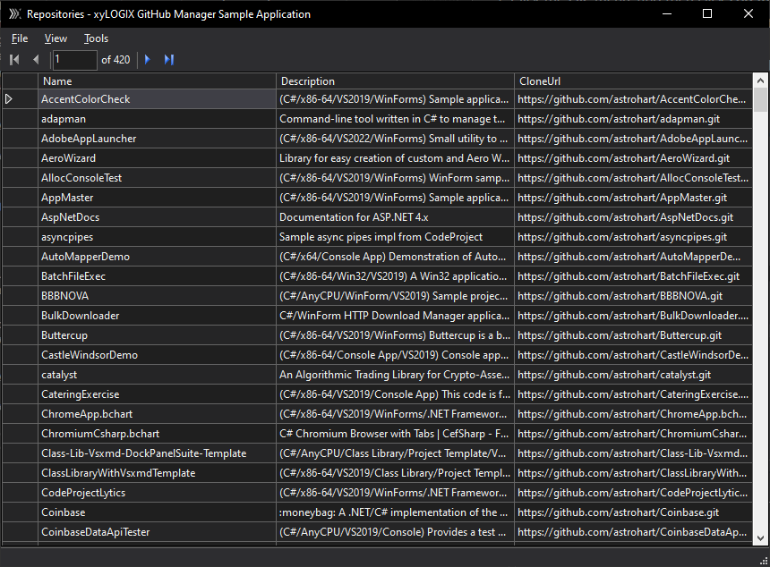

# GitHubManager `windows application`

Shows a proof of concept as to how to implement three-legged OAuth to GitHub with an arbitrary GitHub \"app.\"  The Client ID and Client Secret are specified in a config file, so they can be changed to test with any OAuth app you know the client ID and secret of.  This sample demonstrates the techniques associated with how to allow a user to use their GitHub account with your WinForms app.

**Figure 1.** The main window of the application before you log in.

## Getting Started using the application 

1. Click the **File** menu, and then click **Log In**.
2. If you've not already logged in to an existing GitHub account, you'll be prompted to authorize the app.  Then, you'll be prompted to log in.  Otherwise, a short loading screen will be displayed, and then the application will proceed to download repository information, as shown in **Figure 2**.

**Figure 2.** The application loading repository information.

**Figure 3.** The application after loading repository information.

The application is merely a toy viewer.  Its main purpose is to exercise the functionality of the `xyLOGIX.OAuth.GitHub` module.

## Prerequisites

1. Visual Studio 2017 or later.
2. A GitHub account.
3. The Microsoft .NET Framework 4.8 or later must be installed on your machine.

## Running the tests

This project does not contain any tests.

## Deployment

To deploy this application, you need to build it in Visual Studio, and then copy the contents of the output directory to the target machine.

## Built With

* [Visual Studio 2022](https://visualstudio.microsoft.com/) - The development environment used.
* C# 7.3 - The programming language used.
* Microsoft .NET Framework 4.8 - The framework used.

## Contributing

Please read [CONTRIBUTING.md](CONTRIBUTING.md) for details on our code of conduct, and the process for submitting pull requests to us.

## Versioning

We use [SemVer](http://semver.org/) for versioning.

## Authors

* **Brian C. Hart, Ph.D.** - initial work. 
